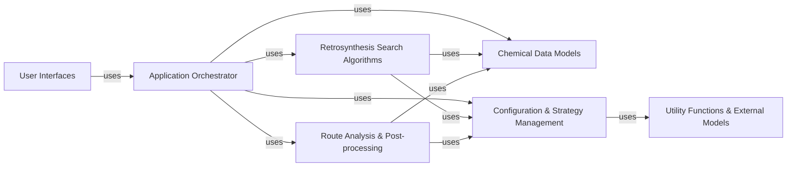

## Details

Component overview for `Application Orchestrator` and other fundamental components of the `aizynthfinder` project, along with their relationships.

### Application Orchestrator [[Expand]](./Application_Orchestrator.md)

The `Application Orchestrator` is the core control unit of the `aizynthfinder` system. It initializes and manages the complete retrosynthesis process, from the initial target molecule input to the final collection and analysis of synthetic routes. This component orchestrates the interaction between various sub-systems, including the application of reaction policies, execution of search algorithms, and utilization of scoring functions. It serves as the primary entry point for executing a retrosynthesis plan, ensuring a cohesive and integrated workflow.

**Related Classes/Methods**:

- `AiZynthFinder` (1:1)

### Chemical Data Models

This component provides the fundamental data structures for representing chemical entities such as molecules and reactions. It includes classes for handling molecular properties, unique molecule identification, and the definition of retro-reactions, which are crucial for the retrosynthesis process.

**Related Classes/Methods**:

- `Molecule` (1:1)

- `RetroReaction` (1:1)

### Configuration & Strategy Management

This component is responsible for managing the application's configuration and injecting various strategies, including expansion policies (how reactions are applied), filter policies (how reactions are pruned), scoring functions (how routes are evaluated), and stock availability queries. It acts as a central context for dependency injection, allowing flexible and extensible behavior.

**Related Classes/Methods**:

- `Configuration` (1:1)

- `ExpansionPolicy` (1:1)

- `FilterPolicy` (1:1)

- `ScorerCollection` (1:1)

- <a href="https://github.com/MolecularAI/aizynthfinder/blob/master/aizynthfinder/context/stock/stock.py#L1-L1" target="_blank" rel="noopener noreferrer">`Stock` (1:1)</a>

### Retrosynthesis Search Algorithms

This component encapsulates the various search algorithms used to explore the retrosynthetic reaction network. It includes implementations of algorithms like Breadth-First Search, DFPn (Depth-First Proof Number search), MCTS (Monte Carlo Tree Search), and Retro* search, which are the core engines for finding synthetic routes.

**Related Classes/Methods**:

- <a href="https://github.com/MolecularAI/aizynthfinder/blob/master/aizynthfinder/search/dfpn/search_tree.py#L1-L1" target="_blank" rel="noopener noreferrer">`SearchTree` (1:1)</a>

- <a href="https://github.com/MolecularAI/aizynthfinder/blob/master/aizynthfinder/search/dfpn/search_tree.py#L1-L1" target="_blank" rel="noopener noreferrer">`SearchTree` (1:1)</a>

- `MctsSearchTree` (1:1)

- <a href="https://github.com/MolecularAI/aizynthfinder/blob/master/aizynthfinder/search/dfpn/search_tree.py#L1-L1" target="_blank" rel="noopener noreferrer">`SearchTree` (1:1)</a>

### Route Analysis & Post-processing

This component is dedicated to the analysis and post-processing of the generated retrosynthetic routes. It includes functionalities for collecting, organizing, and analyzing the discovered reaction trees, providing insights into the feasibility and characteristics of the proposed synthetic pathways.

**Related Classes/Methods**:

- `RouteCollection` (1:1)

- <a href="https://github.com/MolecularAI/aizynthfinder/blob/master/aizynthfinder/analysis/tree_analysis.py#L1-L1" target="_blank" rel="noopener noreferrer">`TreeAnalysis` (1:1)</a>

### User Interfaces [[Expand]](./User_Interfaces.md)

This component provides the various interfaces through which users can interact with the `aizynthfinder` application. This includes command-line interfaces (CLI) for scripting and batch processing, and graphical user interfaces (GUI) for interactive exploration and visualization of retrosynthesis results.

**Related Classes/Methods**:

- `AiZynthApp` (1:1)

- `ParetoFrontsGUI` (1:1)

- `ClusteringGUI` (1:1)

### Utility Functions & External Models

This component comprises general-purpose utility functions and modules for integrating with external machine learning models. It includes functionalities for handling broken bonds, calculating synthetic complexity scores, and providing interfaces for local or remote (gRPC/REST) AI models used in policy expansion or filtering.

**Related Classes/Methods**:

- `BrokenBonds` (1:1)

- `SCScore` (1:1)

- `LocalOnnxModel` (1:1)

### [FAQ](https://github.com/CodeBoarding/GeneratedOnBoardings/tree/main?tab=readme-ov-file#faq)