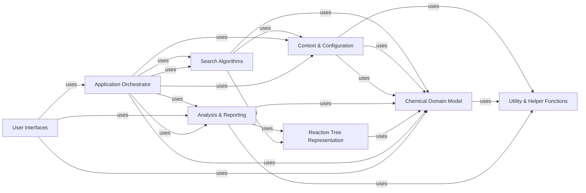

## Details

The Chemical Domain Model is a foundational component within aizynthfinder, serving as the common language and data representation for all cheminformatics-related operations. It defines the core data structures for chemical molecules and retro-reactions, along with essential chemical operations and serialization/deserialization capabilities. Its centrality is evident as almost all other major components directly interact with or depend on its defined objects.

### Chemical Domain Model [[Expand]](./Chemical_Domain_Model.md)

Defines the fundamental data structures for representing chemical molecules (Molecule, TreeMolecule, UniqueMolecule) and retro-reactions (RetroReaction, FixedRetroReaction, SmilesBasedRetroReaction, TemplatedRetroReaction), along with core chemical operations and serialization/deserialization. It provides the common language and data representation for all cheminformatics-related components, ensuring consistent handling of chemical data throughout the application.

**Related Classes/Methods**:

- <a href="https://github.com/MolecularAI/aizynthfinder/blob/master/aizynthfinder/chem/mol.py" target="_blank" rel="noopener noreferrer">`aizynthfinder.chem.mol`</a>

- <a href="https://github.com/MolecularAI/aizynthfinder/blob/master/aizynthfinder/chem/mol.py" target="_blank" rel="noopener noreferrer">`aizynthfinder.chem.mol.Molecule`</a>

- <a href="https://github.com/MolecularAI/aizynthfinder/blob/master/aizynthfinder/chem/mol.py" target="_blank" rel="noopener noreferrer">`aizynthfinder.chem.mol.TreeMolecule`</a>

- <a href="https://github.com/MolecularAI/aizynthfinder/blob/master/aizynthfinder/chem/mol.py" target="_blank" rel="noopener noreferrer">`aizynthfinder.chem.mol.UniqueMolecule`</a>

- <a href="https://github.com/MolecularAI/aizynthfinder/blob/master/aizynthfinder/chem/reaction.py" target="_blank" rel="noopener noreferrer">`aizynthfinder.chem.reaction`</a>

- <a href="https://github.com/MolecularAI/aizynthfinder/blob/master/aizynthfinder/chem/reaction.py" target="_blank" rel="noopener noreferrer">`aizynthfinder.chem.reaction.RetroReaction`</a>

- <a href="https://github.com/MolecularAI/aizynthfinder/blob/master/aizynthfinder/chem/reaction.py" target="_blank" rel="noopener noreferrer">`aizynthfinder.chem.reaction.FixedRetroReaction`</a>

- <a href="https://github.com/MolecularAI/aizynthfinder/blob/master/aizynthfinder/chem/reaction.py" target="_blank" rel="noopener noreferrer">`aizynthfinder.chem.reaction.SmilesBasedRetroReaction`</a>

- <a href="https://github.com/MolecularAI/aizynthfinder/blob/master/aizynthfinder/chem/reaction.py" target="_blank" rel="noopener noreferrer">`aizynthfinder.chem.reaction.TemplatedRetroReaction`</a>

- <a href="https://github.com/MolecularAI/aizynthfinder/blob/master/aizynthfinder/chem/serialization.py" target="_blank" rel="noopener noreferrer">`aizynthfinder.chem.serialization`</a>

### Search Algorithms

Implements retrosynthetic search algorithms (e.g., MCTS, DFPN, Retro*Star, Breadth-First search) to explore chemical reaction pathways. It relies heavily on the Chemical Domain Model to build and traverse search trees.

**Related Classes/Methods**:

- <a href="https://github.com/MolecularAI/aizynthfinder/blob/master/aizynthfinder/aizynthfinder.py" target="_blank" rel="noopener noreferrer">`aizynthfinder.search.mcts`</a>

- <a href="https://github.com/MolecularAI/aizynthfinder/blob/master/aizynthfinder/aizynthfinder.py" target="_blank" rel="noopener noreferrer">`aizynthfinder.search.dfpn`</a>

- <a href="https://github.com/MolecularAI/aizynthfinder/blob/master/aizynthfinder/aizynthfinder.py" target="_blank" rel="noopener noreferrer">`aizynthfinder.search.breadth_first`</a>

- <a href="https://github.com/MolecularAI/aizynthfinder/blob/master/aizynthfinder/aizynthfinder.py" target="_blank" rel="noopener noreferrer">`aizynthfinder.search.retrostar`</a>

- <a href="https://github.com/MolecularAI/aizynthfinder/blob/master/aizynthfinder/aizynthfinder.py" target="_blank" rel="noopener noreferrer">`aizynthfinder.search.nodes`</a>

- `aizynthfinder.search.nodes.MoleculeNode`

- `aizynthfinder.search.nodes.ReactionNode`

- <a href="https://github.com/MolecularAI/aizynthfinder/blob/master/aizynthfinder/aizynthfinder.py" target="_blank" rel="noopener noreferrer">`aizynthfinder.search.search_tree`</a>

- <a href="https://github.com/MolecularAI/aizynthfinder/blob/master/aizynthfinder/search/andor_trees.py" target="_blank" rel="noopener noreferrer">`aizynthfinder.search.andor_trees`</a>

### Context & Configuration

Manages the application's configuration, policy expansion strategies, filter strategies, scoring functions, and stock management. It provides the contextual information and pluggable components that guide the search process, operating on or producing Chemical Domain Model objects.

**Related Classes/Methods**:

- <a href="https://github.com/MolecularAI/aizynthfinder/blob/master/aizynthfinder/aizynthfinder.py" target="_blank" rel="noopener noreferrer">`aizynthfinder.context.policy`</a>

- <a href="https://github.com/MolecularAI/aizynthfinder/blob/master/aizynthfinder/aizynthfinder.py" target="_blank" rel="noopener noreferrer">`aizynthfinder.context.scoring`</a>

- <a href="https://github.com/MolecularAI/aizynthfinder/blob/master/aizynthfinder/aizynthfinder.py" target="_blank" rel="noopener noreferrer">`aizynthfinder.context.stock`</a>

- <a href="https://github.com/MolecularAI/aizynthfinder/blob/master/aizynthfinder/context/config.py" target="_blank" rel="noopener noreferrer">`aizynthfinder.context.config`</a>

- <a href="https://github.com/MolecularAI/aizynthfinder/blob/master/aizynthfinder/context/collection.py" target="_blank" rel="noopener noreferrer">`aizynthfinder.context.collection`</a>

### Analysis & Reporting

Provides modules for post-processing and analyzing search results, generating synthetic routes, and visualizing reaction trees. It interprets and presents data using Chemical Domain Model objects and Reaction Tree Representation.

**Related Classes/Methods**:

- <a href="https://github.com/MolecularAI/aizynthfinder/blob/master/aizynthfinder/analysis/tree_analysis.py" target="_blank" rel="noopener noreferrer">`aizynthfinder.analysis.tree_analysis`</a>

- <a href="https://github.com/MolecularAI/aizynthfinder/blob/master/aizynthfinder/analysis/routes.py" target="_blank" rel="noopener noreferrer">`aizynthfinder.analysis.routes`</a>

- <a href="https://github.com/MolecularAI/aizynthfinder/blob/master/aizynthfinder/analysis/utils.py" target="_blank" rel="noopener noreferrer">`aizynthfinder.analysis.utils`</a>

### Reaction Tree Representation

Responsible for constructing, loading, and manipulating reaction trees, which are fundamental data structures representing the discovered synthetic pathways. It relies on Molecule and RetroReaction objects from the Chemical Domain Model.

**Related Classes/Methods**:

- <a href="https://github.com/MolecularAI/aizynthfinder/blob/master/aizynthfinder/reactiontree.py" target="_blank" rel="noopener noreferrer">`aizynthfinder.reactiontree.reactiontree`</a>

- <a href="https://github.com/MolecularAI/aizynthfinder/blob/master/aizynthfinder/reactiontree.py" target="_blank" rel="noopener noreferrer">`aizynthfinder.reactiontree.reactiontree_loader`</a>

### Application Orchestrator [[Expand]](./Application_Orchestrator.md)

Contains the main application logic and entry points, orchestrating the interactions between the Search Algorithms, Context & Configuration, and Analysis & Reporting components to perform retrosynthetic planning.

**Related Classes/Methods**:

- <a href="https://github.com/MolecularAI/aizynthfinder/blob/master/aizynthfinder/aizynthfinder.py" target="_blank" rel="noopener noreferrer">`aizynthfinder.aizynthfinder`</a>

### User Interfaces [[Expand]](./User_Interfaces.md)

Provides the presentation layer for user interaction, including command-line tools and a graphical user interface. It interacts with the Application Orchestrator and directly with the Chemical Domain Model for input and output of chemical structures.

**Related Classes/Methods**:

- <a href="https://github.com/MolecularAI/aizynthfinder/blob/master/aizynthfinder/interfaces/aizynthcli.py" target="_blank" rel="noopener noreferrer">`aizynthfinder.interfaces.aizynthcli`</a>

- <a href="https://github.com/MolecularAI/aizynthfinder/blob/master/aizynthfinder/interfaces/aizynthapp.py" target="_blank" rel="noopener noreferrer">`aizynthfinder.interfaces.aizynthapp`</a>

- <a href="https://github.com/MolecularAI/aizynthfinder/blob/master/aizynthfinder/aizynthfinder.py" target="_blank" rel="noopener noreferrer">`aizynthfinder.interfaces.gui`</a>

### Utility & Helper Functions

Offers a collection of general-purpose utility functions and helper classes for various operations across the application, including chemical bond manipulation, exception handling, logging, data loading, type validation, image rendering, and integration with external machine learning models.

**Related Classes/Methods**:

- <a href="https://github.com/MolecularAI/aizynthfinder/blob/master/aizynthfinder/utils/bonds.py" target="_blank" rel="noopener noreferrer">`aizynthfinder.utils.bonds`</a>

- <a href="https://github.com/MolecularAI/aizynthfinder/blob/master/aizynthfinder/utils/exceptions.py" target="_blank" rel="noopener noreferrer">`aizynthfinder.utils.exceptions`</a>

- <a href="https://github.com/MolecularAI/aizynthfinder/blob/master/aizynthfinder/utils/logging.py" target="_blank" rel="noopener noreferrer">`aizynthfinder.utils.logging`</a>

- <a href="https://github.com/MolecularAI/aizynthfinder/blob/master/aizynthfinder/utils/loading.py" target="_blank" rel="noopener noreferrer">`aizynthfinder.utils.loading`</a>

- <a href="https://github.com/MolecularAI/aizynthfinder/blob/master/aizynthfinder/utils/type_utils.py" target="_blank" rel="noopener noreferrer">`aizynthfinder.utils.type_utils`</a>

- <a href="https://github.com/MolecularAI/aizynthfinder/blob/master/aizynthfinder/utils/image.py" target="_blank" rel="noopener noreferrer">`aizynthfinder.utils.image`</a>

- <a href="https://github.com/MolecularAI/aizynthfinder/blob/master/aizynthfinder/utils/models.py" target="_blank" rel="noopener noreferrer">`aizynthfinder.utils.models`</a>

- <a href="https://github.com/MolecularAI/aizynthfinder/blob/master/aizynthfinder/utils/sc_score.py" target="_blank" rel="noopener noreferrer">`aizynthfinder.utils.sc_score`</a>

### [FAQ](https://github.com/CodeBoarding/GeneratedOnBoardings/tree/main?tab=readme-ov-file#faq)