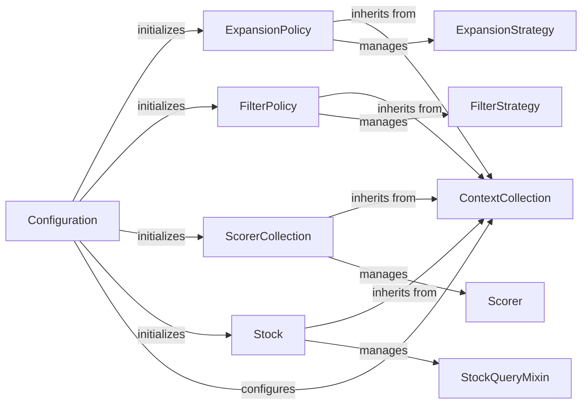

## Details

The `Configuration & Context Management` subsystem is the backbone for managing application settings and dynamically injecting various strategies (policies, scorers, stock sources) into the `aizynthfinder` application. It adheres strongly to the Strategy Pattern and Dependency Injection principles, making the system highly modular, extensible, and configurable.

### Configuration

This is the central configuration manager. It is responsible for loading application settings from various sources (e.g., YAML files), parsing them, and then using these settings to initialize and provide instances of other core components like `ExpansionPolicy`, `FilterPolicy`, `ScorerCollection`, and `Stock`. It acts as a primary dependency injector, ensuring that other parts of the application receive pre-configured strategy instances.

**Related Classes/Methods**:

- <a href="https://github.com/MolecularAI/aizynthfinder/blob/master/aizynthfinder/context/config.py" target="_blank" rel="noopener noreferrer">`aizynthfinder.context.config.Configuration`</a>

### ContextCollection

This is an abstract base class that provides a generic mechanism for managing collections of pluggable strategies. It defines the interface for adding, retrieving, and iterating over different implementations of a specific type of strategy. `ExpansionPolicy`, `FilterPolicy`, `ScorerCollection`, and `Stock` all inherit from this class, leveraging its capabilities for dynamic strategy management.

**Related Classes/Methods**:

- <a href="https://github.com/MolecularAI/aizynthfinder/blob/master/aizynthfinder/context/collection.py" target="_blank" rel="noopener noreferrer">`aizynthfinder.context.collection.ContextCollection`</a>

### ExpansionPolicy

Manages and provides access to various "expansion strategies." These strategies define how a target molecule can be retro-synthetically expanded into possible precursor molecules, often using reaction templates or machine learning models. It selects and applies the appropriate `ExpansionStrategy` based on the current configuration.

**Related Classes/Methods**:

- <a href="https://github.com/MolecularAI/aizynthfinder/blob/master/aizynthfinder/context/policy/policies.py" target="_blank" rel="noopener noreferrer">`aizynthfinder.context.policy.policies.ExpansionPolicy`</a>

### ExpansionStrategy

An abstract base class defining the interface for concrete expansion algorithms. Implementations of this class (e.g., `TemplateBasedExpansionStrategy`, `MultiExpansionStrategy`) perform the actual chemical transformations to suggest precursors.

**Related Classes/Methods**:

- <a href="https://github.com/MolecularAI/aizynthfinder/blob/master/aizynthfinder/context/policy/expansion_strategies.py" target="_blank" rel="noopener noreferrer">`aizynthfinder.context.policy.expansion_strategies.ExpansionStrategy`</a>

### FilterPolicy

Manages and provides access to "filter strategies." These strategies are used to prune or filter out undesirable reactions or molecules during the retrosynthetic search, based on criteria like chemical properties, reaction feasibility, or other constraints.

**Related Classes/Methods**:

- <a href="https://github.com/MolecularAI/aizynthfinder/blob/master/aizynthfinder/context/policy/policies.py" target="_blank" rel="noopener noreferrer">`aizynthfinder.context.policy.policies.FilterPolicy`</a>

### FilterStrategy

An abstract base class defining the interface for concrete filtering algorithms. Implementations (e.g., `BondFilter`, `ReactantsCountFilter`) apply specific rules to accept or reject molecules or reactions.

**Related Classes/Methods**:

- <a href="https://github.com/MolecularAI/aizynthfinder/blob/master/aizynthfinder/context/policy/filter_strategies.py" target="_blank" rel="noopener noreferrer">`aizynthfinder.context.policy.filter_strategies.FilterStrategy`</a>

### ScorerCollection

Manages and provides access to various "scoring functions." These functions evaluate the quality or desirability of molecules, reactions, or entire synthetic routes, enabling multi-objective optimization of synthetic plans.

**Related Classes/Methods**:

- <a href="https://github.com/MolecularAI/aizynthfinder/blob/master/aizynthfinder/context/scoring/collection.py" target="_blank" rel="noopener noreferrer">`aizynthfinder.context.scoring.collection.ScorerCollection`</a>

### Scorer

An abstract base class defining the interface for concrete scoring functions. Implementations (e.g., `FractionInStockScorer`, `RouteCostScorer`) calculate a numerical score based on specific criteria.

**Related Classes/Methods**:

- <a href="https://github.com/MolecularAI/aizynthfinder/blob/master/aizynthfinder/context/scoring/scorers.py" target="_blank" rel="noopener noreferrer">`aizynthfinder.context.scoring.scorers.Scorer`</a>

### Stock

Manages and provides access to chemical stock information. It allows the application to determine if a molecule is readily available as a starting material, integrating with various stock databases or in-memory collections via `StockQueryMixin` implementations.

**Related Classes/Methods**:

- <a href="https://github.com/MolecularAI/aizynthfinder/blob/master/aizynthfinder/context/stock/stock.py" target="_blank" rel="noopener noreferrer">`aizynthfinder.context.stock.stock.Stock`</a>

### StockQueryMixin

An abstract base class defining the interface for querying stock availability. Implementations (e.g., `InMemoryInchiKeyQuery`, `MolbloomFilterQuery`) provide specific methods for checking if a molecule is in stock.

**Related Classes/Methods**:

- <a href="https://github.com/MolecularAI/aizynthfinder/blob/master/aizynthfinder/context/stock/queries.py" target="_blank" rel="noopener noreferrer">`aizynthfinder.context.stock.queries.StockQueryMixin`</a>

### [FAQ](https://github.com/CodeBoarding/GeneratedOnBoardings/tree/main?tab=readme-ov-file#faq)