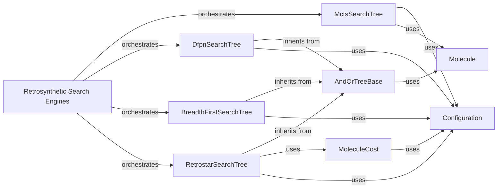

## Details

Analysis of the 'Retrosynthetic Search Engines' component and its related components within the 'aizynthfinder' project, detailing their structure, flow, and purpose.

### Retrosynthetic Search Engines [[Expand]](./Retrosynthetic_Search_Engines.md)

This is the overarching component that orchestrates various search algorithms to explore the chemical reaction space and discover synthetic pathways. It acts as the control center, initiating and managing the search process using different strategies.

**Related Classes/Methods**:

- <a href="https://github.com/MolecularAI/aizynthfinder/blob/master/aizynthfinder/search/mcts/search.py" target="_blank" rel="noopener noreferrer">`aizynthfinder.search.mcts.search`</a>

- <a href="https://github.com/MolecularAI/aizynthfinder/blob/master/aizynthfinder/search/dfpn/search_tree.py" target="_blank" rel="noopener noreferrer">`aizynthfinder.search.dfpn.search_tree`</a>

- <a href="https://github.com/MolecularAI/aizynthfinder/blob/master/aizynthfinder/search/breadth_first/search_tree.py" target="_blank" rel="noopener noreferrer">`aizynthfinder.search.breadth_first.search_tree`</a>

- <a href="https://github.com/MolecularAI/aizynthfinder/blob/master/aizynthfinder/search/retrostar/search_tree.py" target="_blank" rel="noopener noreferrer">`aizynthfinder.search.retrostar.search_tree`</a>

- <a href="https://github.com/MolecularAI/aizynthfinder/blob/master/aizynthfinder/search/andor_trees.py" target="_blank" rel="noopener noreferrer">`aizynthfinder.search.andor_trees`</a>

### AndOrTreeBase

This component provides the foundational abstract classes and mixins for representing the retrosynthetic search space as an AND/OR tree. It defines the common structure for nodes (e.g., `MoleculeNode`, `ReactionNode`) and basic operations that specific search algorithms like DFPN, Breadth-First, and Retro* can build upon.

**Related Classes/Methods**:

- <a href="https://github.com/MolecularAI/aizynthfinder/blob/master/aizynthfinder/search/andor_trees.py" target="_blank" rel="noopener noreferrer">`aizynthfinder.search.andor_trees`</a>

### MctsSearchTree

Implements the Monte Carlo Tree Search (MCTS) algorithm. It manages its specific tree structure and search process, which involves iterative steps of selection, expansion, simulation (rollout), and backpropagation to efficiently explore the search space, particularly useful for large and complex reaction networks.

**Related Classes/Methods**:

- <a href="https://github.com/MolecularAI/aizynthfinder/blob/master/aizynthfinder/search/mcts/search.py" target="_blank" rel="noopener noreferrer">`aizynthfinder.search.mcts.search`</a>

### DfpnSearchTree

Implements the Depth-First Proof-Number Search (DFPN) algorithm. It leverages the `AndOrTreeBase` to perform a depth-first search, maintaining proof and disproof numbers to efficiently find provable or disprovable synthetic routes, guaranteeing optimality under certain conditions.

**Related Classes/Methods**:

- <a href="https://github.com/MolecularAI/aizynthfinder/blob/master/aizynthfinder/search/dfpn/search_tree.py" target="_blank" rel="noopener noreferrer">`aizynthfinder.search.dfpn.search_tree`</a>

### BreadthFirstSearchTree

Implements the Breadth-First Search (BFS) algorithm, exploring the reaction tree level by level. It also builds upon the `AndOrTreeBase` framework, ensuring that the shortest path (in terms of number of reaction steps) is found first.

**Related Classes/Methods**:

- <a href="https://github.com/MolecularAI/aizynthfinder/blob/master/aizynthfinder/search/breadth_first/search_tree.py" target="_blank" rel="noopener noreferrer">`aizynthfinder.search.breadth_first.search_tree`</a>

### RetrostarSearchTree

Implements the Retro* search algorithm, a cost-based search that prioritizes pathways with lower overall costs. It integrates with the `AndOrTreeBase` structure and its own `MoleculeCost` component to guide the search based on economic or synthetic feasibility.

**Related Classes/Methods**:

- <a href="https://github.com/MolecularAI/aizynthfinder/blob/master/aizynthfinder/search/retrostar/search_tree.py" target="_blank" rel="noopener noreferrer">`aizynthfinder.search.retrostar.search_tree`</a>

### MoleculeCost

This component is specific to the Retro* algorithm and is responsible for calculating and managing the costs associated with molecules and reactions within the search tree. These costs directly influence the Retro* algorithm's decision-making, guiding it towards more favorable pathways.

**Related Classes/Methods**:

- <a href="https://github.com/MolecularAI/aizynthfinder/blob/master/aizynthfinder/search/retrostar/cost.py" target="_blank" rel="noopener noreferrer">`aizynthfinder.search.retrostar.cost`</a>

### Molecule

Represents chemical molecules, serving as the fundamental data unit within all search trees. Nodes in the search tree (e.g., `MoleculeNode`, `ReactionNode`) encapsulate or refer to instances of `Molecule`.

**Related Classes/Methods**:

- <a href="https://github.com/MolecularAI/aizynthfinder/blob/master/aizynthfinder/chem/mol.py" target="_blank" rel="noopener noreferrer">`aizynthfinder.chem.mol`</a>

### Configuration

A central component that provides all necessary parameters, policies (expansion, filter), and scorers to the search algorithms, enabling flexible and configurable search behavior. It acts as a dependency injection mechanism for various strategies.

**Related Classes/Methods**:

- <a href="https://github.com/MolecularAI/aizynthfinder/blob/master/aizynthfinder/context/config.py" target="_blank" rel="noopener noreferrer">`aizynthfinder.context.config`</a>

### [FAQ](https://github.com/CodeBoarding/GeneratedOnBoardings/tree/main?tab=readme-ov-file#faq)