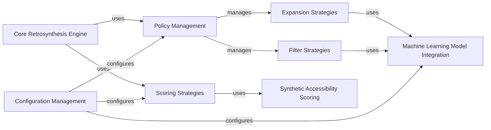

## Details

Analysis of the Retrosynthetic Strategy Framework in aizynthfinder project.

### Policy Management

This component is responsible for orchestrating and applying the various expansion and filter strategies during the retrosynthesis search. It acts as a central registry for these policies, allowing the system to dynamically select and execute the appropriate strategy.

**Related Classes/Methods**:

- <a href="https://github.com/MolecularAI/aizynthfinder/blob/master/aizynthfinder/context/policy/policies.py#L1-L100" target="_blank" rel="noopener noreferrer">`aizynthfinder.context.policy.policies` (1:100)</a>

### Expansion Strategies

This component defines and implements the logic for generating possible retro-reactions from a given molecule. These strategies often leverage machine learning models to predict suitable reaction templates or outcomes.

**Related Classes/Methods**:

- <a href="https://github.com/MolecularAI/aizynthfinder/blob/master/aizynthfinder/context/policy/expansion_strategies.py#L1-L100" target="_blank" rel="noopener noreferrer">`aizynthfinder.context.policy.expansion_strategies` (1:100)</a>

### Filter Strategies

This component defines and implements methods for pruning undesirable or invalid reactions and molecules generated during the retrosynthesis process. This helps in reducing the search space and focusing on chemically sound pathways.

**Related Classes/Methods**:

- <a href="https://github.com/MolecularAI/aizynthfinder/blob/master/aizynthfinder/context/policy/filter_strategies.py#L1-L100" target="_blank" rel="noopener noreferrer">`aizynthfinder.context.policy.filter_strategies` (1:100)</a>

### Scoring Strategies

This component provides a collection of algorithms and methods for evaluating the quality, feasibility, and desirability of molecules and complete reaction routes. It aggregates various scoring functions to provide a comprehensive assessment.

**Related Classes/Methods**:

- <a href="https://github.com/MolecularAI/aizynthfinder/blob/master/aizynthfinder/context/scoring/collection.py#L1-L100" target="_blank" rel="noopener noreferrer">`aizynthfinder.context.scoring.collection` (1:100)</a>

- <a href="https://github.com/MolecularAI/aizynthfinder/blob/master/aizynthfinder/context/scoring/scorers.py#L1-L100" target="_blank" rel="noopener noreferrer">`aizynthfinder.context.scoring.scorers` (1:100)</a>

### Machine Learning Model Integration

This component offers a standardized interface for loading and interacting with diverse machine learning models, including local Keras/ONNX models and external models accessed via gRPC or REST APIs. It abstracts the underlying ML framework details.

**Related Classes/Methods**:

- <a href="https://github.com/MolecularAI/aizynthfinder/blob/master/aizynthfinder/utils/models.py#L1-L100" target="_blank" rel="noopener noreferrer">`aizynthfinder.utils.models` (1:100)</a>

### Synthetic Accessibility Scoring

This specialized component implements the SCScore algorithm, a widely used metric for estimating the synthetic accessibility of a molecule. It's a specific type of scoring function used within the broader `Scoring Strategies`.

**Related Classes/Methods**:

- <a href="https://github.com/MolecularAI/aizynthfinder/blob/master/aizynthfinder/utils/sc_score.py#L1-L100" target="_blank" rel="noopener noreferrer">`aizynthfinder.utils.sc_score` (1:100)</a>

### Configuration Management

This component is responsible for loading, parsing, and providing access to the application's configuration settings. It dictates which specific strategies, models, and parameters are used throughout the retrosynthesis process.

**Related Classes/Methods**:

- <a href="https://github.com/MolecularAI/aizynthfinder/blob/master/aizynthfinder/context/config.py#L1-L100" target="_blank" rel="noopener noreferrer">`aizynthfinder.context.config` (1:100)</a>

### Core Retrosynthesis Engine

This is the main orchestrator of the retrosynthesis process, responsible for initiating and managing the search for synthetic routes. It integrates and utilizes the various strategy components to perform the overall retrosynthetic planning.

**Related Classes/Methods**:

- <a href="https://github.com/MolecularAI/aizynthfinder/blob/master/aizynthfinder/aizynthfinder.py#L1-L100" target="_blank" rel="noopener noreferrer">`aizynthfinder.aizynthfinder` (1:100)</a>

### [FAQ](https://github.com/CodeBoarding/GeneratedOnBoardings/tree/main?tab=readme-ov-file#faq)