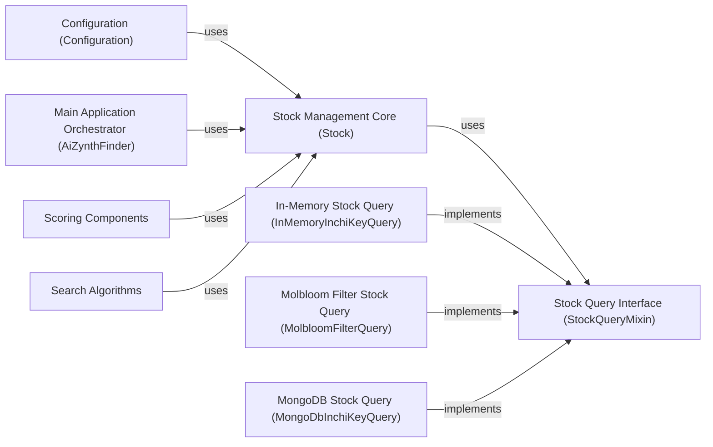

## Details

The `Stock Management` component in `aizynthfinder` is crucial for determining the availability of starting materials, which directly impacts the feasibility and scoring of retrosynthetic pathways. It embodies a **Strategy Pattern**, allowing for flexible integration of various stock sources.

### Stock Management Core (Stock)

This is the central facade for the Stock Management subsystem. It provides a unified interface for checking if a molecule is "in stock" by delegating the actual query to a configured stock query strategy. It acts as the primary entry point for other parts of the application needing stock information.

**Related Classes/Methods**:

- <a href="https://github.com/MolecularAI/aizynthfinder/blob/master/aizynthfinder/context/stock/stock.py" target="_blank" rel="noopener noreferrer">`aizynthfinder.context.stock.stock.Stock`</a>

### Stock Query Interface (StockQueryMixin)

This abstract base class (mixin) defines the contract for all concrete stock query implementations. It specifies the methods that any stock source must implement to be compatible with the `Stock` component, enforcing the Strategy Pattern.

**Related Classes/Methods**:

- <a href="https://github.com/MolecularAI/aizynthfinder/blob/master/aizynthfinder/context/stock/queries.py" target="_blank" rel="noopener noreferrer">`aizynthfinder.context.stock.queries.StockQueryMixin`</a>

### In-Memory Stock Query (InMemoryInchiKeyQuery)

A concrete implementation of `StockQueryMixin` that performs stock checks against a collection of InChIKeys loaded directly into memory. This is suitable for smaller, static datasets or testing environments.

**Related Classes/Methods**:

- <a href="https://github.com/MolecularAI/aizynthfinder/blob/master/aizynthfinder/context/stock/queries.py" target="_blank" rel="noopener noreferrer">`aizynthfinder.context.stock.queries.InMemoryInchiKeyQuery`</a>

### Molbloom Filter Stock Query (MolbloomFilterQuery)

A concrete implementation of `StockQueryMixin` that leverages a `molbloom` filter (a specialized Bloom filter for molecules) for highly efficient, probabilistic stock availability checks. It's optimized for very large datasets where memory footprint and query speed are critical.

**Related Classes/Methods**:

- <a href="https://github.com/MolecularAI/aizynthfinder/blob/master/aizynthfinder/context/stock/queries.py" target="_blank" rel="noopener noreferrer">`aizynthfinder.context.stock.queries.MolbloomFilterQuery`</a>

### MongoDB Stock Query (MongoDbInchiKeyQuery)

A concrete implementation of `StockQueryMixin` that connects to and queries a MongoDB database for stock availability. This enables persistent, dynamic, and potentially distributed stock management.

**Related Classes/Methods**:

- <a href="https://github.com/MolecularAI/aizynthfinder/blob/master/aizynthfinder/context/stock/queries.py" target="_blank" rel="noopener noreferrer">`aizynthfinder.context.stock.queries.MongoDbInchiKeyQuery`</a>

### Configuration (Configuration)

This component is responsible for loading and managing the application's settings, including which specific `StockQueryMixin` implementation (e.g., In-Memory, Molbloom, MongoDB) should be instantiated and used by the `Stock` component.

**Related Classes/Methods**:

- <a href="https://github.com/MolecularAI/aizynthfinder/blob/master/aizynthfinder/context/config.py" target="_blank" rel="noopener noreferrer">`aizynthfinder.context.config.Configuration`</a>

### Main Application Orchestrator (AiZynthFinder)

The top-level class that orchestrates the entire retrosynthetic planning process. It utilizes the `Stock` component to determine the availability of starting materials, which is a critical factor in guiding search algorithms and evaluating the practicality of proposed routes.

**Related Classes/Methods**:

- <a href="https://github.com/MolecularAI/aizynthfinder/blob/master/aizynthfinder/aizynthfinder.py" target="_blank" rel="noopener noreferrer">`aizynthfinder.aizynthfinder.AiZynthFinder`</a>

### Scoring Components

These are specific scoring strategies within the broader Scoring component. They evaluate the "goodness" of a synthetic route or intermediate based on the availability of its precursors in stock, directly querying the `Stock` component.

**Related Classes/Methods**:

- <a href="https://github.com/MolecularAI/aizynthfinder/blob/master/aizynthfinder/context/scoring/scorers.py" target="_blank" rel="noopener noreferrer">`aizynthfinder.context.scoring.scorers.FractionInStockScorer`</a>

- <a href="https://github.com/MolecularAI/aizynthfinder/blob/master/aizynthfinder/context/scoring/scorers.py" target="_blank" rel="noopener noreferrer">`aizynthfinder.context.scoring.scorers.StockAvailabilityScorer`</a>

### Search Algorithms

Various search algorithms (e.g., Breadth-First, DFPn, Retro*) interact with the Stock Management component. They might query stock availability during the search process to prune unfeasible branches, prioritize paths leading to available precursors, or construct reaction trees based on stock status.

**Related Classes/Methods**:

- <a href="https://github.com/MolecularAI/aizynthfinder/blob/master/aizynthfinder/search/andor_trees.py#L178-L236" target="_blank" rel="noopener noreferrer">`aizynthfinder.search.andor_trees.ReactionTreeFromAndOrTrace` (178:236)</a>

### [FAQ](https://github.com/CodeBoarding/GeneratedOnBoardings/tree/main?tab=readme-ov-file#faq)