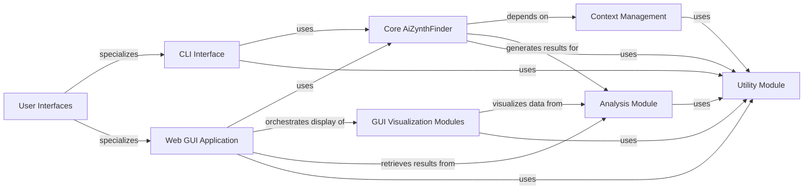

## Details

The User Interfaces component in AiZynthFinder serves as the primary interaction layer, offering both a command-line interface (CLI) for scripting and a web-based graphical user interface (GUI) for interactive exploration. This design aligns with the Command Query Responsibility Segregation (CQRS) pattern, where the CLI handles "commands" (initiating searches) and the GUI focuses on "queries" (displaying and analyzing results).

### User Interfaces [[Expand]](./User_Interfaces.md)

The overarching component providing various means for users to interact with the AiZynthFinder application. It abstracts the different interaction modes.

**Related Classes/Methods**:

- <a href="https://github.com/MolecularAI/aizynthfinder/blob/master/aizynthfinder/aizynthfinder.py" target="_blank" rel="noopener noreferrer">`aizynthfinder.interfaces`</a>

### CLI Interface

Provides a command-line interface for batch processing, scripting, and direct execution of retrosynthetic searches. It parses arguments and orchestrates the core application logic.

**Related Classes/Methods**:

- <a href="https://github.com/MolecularAI/aizynthfinder/blob/master/aizynthfinder/interfaces/aizynthcli.py" target="_blank" rel="noopener noreferrer">`aizynthfinder.interfaces.aizynthcli`</a>

### Web GUI Application

Implements the web-based graphical user interface, managing user sessions, interactive search execution, and data presentation. It acts as the backend for the interactive user experience.

**Related Classes/Methods**:

- <a href="https://github.com/MolecularAI/aizynthfinder/blob/master/aizynthfinder/interfaces/aizynthapp.py" target="_blank" rel="noopener noreferrer">`aizynthfinder.interfaces.aizynthapp.AiZynthApp`</a>

### GUI Visualization Modules

Contains specific modules and utilities for rendering interactive visualizations within the web GUI, such as Pareto fronts, clustered results, and search tree displays.

**Related Classes/Methods**:

- <a href="https://github.com/MolecularAI/aizynthfinder/blob/master/aizynthfinder/aizynthfinder.py" target="_blank" rel="noopener noreferrer">`aizynthfinder.interfaces.gui`</a>

### Core AiZynthFinder

Encapsulates the primary retrosynthetic planning logic, coordinating search algorithms, policy application, and result generation. It's the central engine that both CLI and GUI interact with.

**Related Classes/Methods**:

- <a href="https://github.com/MolecularAI/aizynthfinder/blob/master/aizynthfinder/aizynthfinder.py" target="_blank" rel="noopener noreferrer">`aizynthfinder.aizynthfinder.AiZynthFinder`</a>

### Analysis Module

Responsible for post-processing and structuring the raw results from the search algorithms into meaningful data representations, such as route collections and tree analyses, suitable for display or further computation.

**Related Classes/Methods**:

- <a href="https://github.com/MolecularAI/aizynthfinder/blob/master/aizynthfinder/aizynthfinder.py" target="_blank" rel="noopener noreferrer">`aizynthfinder.analysis`</a>

### Context Management [[Expand]](./Context_Management.md)

Provides a centralized mechanism for managing application configuration, expansion policies, filter policies, scoring functions, and stock information. It acts as a dependency injection container for various strategies.

**Related Classes/Methods**:

- <a href="https://github.com/MolecularAI/aizynthfinder/blob/master/aizynthfinder/aizynthfinder.py" target="_blank" rel="noopener noreferrer">`aizynthfinder.context`</a>

### Utility Module

A collection of general-purpose helper functions and common utilities used across different parts of the application, including file handling, logging, and data manipulation.

**Related Classes/Methods**:

- <a href="https://github.com/MolecularAI/aizynthfinder/blob/master/aizynthfinder/aizynthfinder.py" target="_blank" rel="noopener noreferrer">`aizynthfinder.utils`</a>

### [FAQ](https://github.com/CodeBoarding/GeneratedOnBoardings/tree/main?tab=readme-ov-file#faq)