```mermaid

graph LR

    Application_Orchestrator["Application Orchestrator"]

    Configuration_Context_Management["Configuration & Context Management"]

    Chemical_Domain_Model["Chemical Domain Model"]

    Retrosynthetic_Strategy_Framework["Retrosynthetic Strategy Framework"]

    Stock_Management["Stock Management"]

    Retrosynthetic_Search_Engines["Retrosynthetic Search Engines"]

    Reaction_Pathway_Analysis_Management["Reaction Pathway Analysis & Management"]

    User_Interfaces["User Interfaces"]

    Application_Orchestrator -- "Initializes/Uses" --> Configuration_Context_Management

    Application_Orchestrator -- "Orchestrates" --> Retrosynthetic_Search_Engines

    Configuration_Context_Management -- "Configures" --> Retrosynthetic_Strategy_Framework

    Configuration_Context_Management -- "Configures" --> Stock_Management

    Chemical_Domain_Model -- "Provides Data To" --> Retrosynthetic_Strategy_Framework

    Chemical_Domain_Model -- "Provides Data To" --> Retrosynthetic_Search_Engines

    Retrosynthetic_Strategy_Framework -- "Uses" --> Chemical_Domain_Model

    Retrosynthetic_Strategy_Framework -- "Uses" --> Stock_Management

    Stock_Management -- "Uses" --> Chemical_Domain_Model

    Stock_Management -- "Provides Info To" --> Retrosynthetic_Strategy_Framework

    Retrosynthetic_Search_Engines -- "Uses" --> Chemical_Domain_Model

    Retrosynthetic_Search_Engines -- "Applies" --> Retrosynthetic_Strategy_Framework

    Reaction_Pathway_Analysis_Management -- "Processes Output From" --> Retrosynthetic_Search_Engines

    Reaction_Pathway_Analysis_Management -- "Provides Results To" --> Application_Orchestrator

    User_Interfaces -- "Interacts With" --> Application_Orchestrator

    User_Interfaces -- "Visualizes" --> Reaction_Pathway_Analysis_Management

    click Application_Orchestrator href "https://github.com/MolecularAI/aizynthfinder/blob/master/.codeboarding//Application_Orchestrator.md" "Details"

    click Configuration_Context_Management href "https://github.com/MolecularAI/aizynthfinder/blob/master/.codeboarding//Configuration_Context_Management.md" "Details"

    click Chemical_Domain_Model href "https://github.com/MolecularAI/aizynthfinder/blob/master/.codeboarding//Chemical_Domain_Model.md" "Details"

    click Retrosynthetic_Strategy_Framework href "https://github.com/MolecularAI/aizynthfinder/blob/master/.codeboarding//Retrosynthetic_Strategy_Framework.md" "Details"

    click Stock_Management href "https://github.com/MolecularAI/aizynthfinder/blob/master/.codeboarding//Stock_Management.md" "Details"

    click Retrosynthetic_Search_Engines href "https://github.com/MolecularAI/aizynthfinder/blob/master/.codeboarding//Retrosynthetic_Search_Engines.md" "Details"

    click User_Interfaces href "https://github.com/MolecularAI/aizynthfinder/blob/master/.codeboarding//User_Interfaces.md" "Details"

```

## Details

The `aizynthfinder` project exhibits a well-structured, modular architecture typical of a Scientific AI/ML application in Cheminformatics. The core design emphasizes separation of concerns, allowing for flexible integration of various strategies and algorithms. Here's a high-level data flow overview, identifying the central components and their interactions: Final Architecture Components 1. Application Orchestrator Description: The central control unit that initializes the retrosynthesis process, orchestrates the search, and manages the overall workflow from target molecule input to route collection. It acts as the main entry point for executing a retrosynthesis plan. Source Files: `aizynthfinder/aizynthfinder/aizynthfinder.py` 2. Configuration & Context Management Description: Manages application-wide settings, loads configurations from various sources (e.g., YAML files), and provides a centralized context for accessing and injecting different strategies (policies, scorers, stock sources) throughout the application. It ensures that components are initialized with the correct dependencies. Source Files: `aizynthfinder/context/config.py`, `aizynthfinder/context/collection.py` 3. Chemical Domain Model Description: Defines the fundamental data structures for representing chemical molecules and retro-reactions, along with core chemical operations and serialization/deserialization. It provides the common language and data representation for all cheminformatics-related components. Source Files: `aizynthfinder/chem/mol.py`, `aizynthfinder/chem/reaction.py`, `aizynthfinder/chem/serialization.py` 4. Retrosynthetic Strategy Framework Description: Provides a flexible, plugin-based architecture for defining and managing various strategies involved in retrosynthesis. This includes expansion strategies (generating possible retro-reactions, often using ML models), filter strategies (pruning undesirable reactions or molecules), and scoring strategies (evaluating the quality of molecules and reaction routes). It also encapsulates the integration with underlying machine learning models. Source Files: `aizynthfinder/context/policy/policies.py`, `aizynthfinder/context/policy/expansion_strategies.py`, `aizynthfinder/context/policy/filter_strategies.py`, `aizynthfinder/context/scoring/collection.py`, `aizynthfinder/context/scoring/scorers.py`, `aizynthfinder/plugins/expansion_strategies.py`, `aizynthfinder/utils/models.py`, `aizynthfinder/utils/sc_score.py` 5. Stock Management Description: Manages and queries the availability of starting materials from various configured sources (e.g., in-memory databases, external databases like MongoDB, or bloom filters). It determines if a molecule is "in stock" and thus a valid precursor for a synthetic pathway. Source Files: `aizynthfinder/context/stock/stock.py`, `aizynthfinder/context/stock/queries.py` 6. Retrosynthetic Search Engines Description: Implements various search algorithms (e.g., Monte Carlo Tree Search, Depth-First Proof-Number Search, Breadth-First Search, Retro*) to explore the chemical reaction space and discover synthetic pathways from a target molecule to available precursors. It builds and traverses the reaction tree based on the defined strategies. Source Files: `aizynthfinder/search/mcts/search.py`, `aizynthfinder/search/dfpn/search_tree.py`, `aizynthfinder/search/breadth_first/search_tree.py`, `aizynthfinder/search/retrostar/search_tree.py`, `aizynthfinder/search/andor_trees.py` 7. Reaction Pathway Analysis & Management Description: Collects, stores, and provides functionalities for managing, filtering, analyzing, and visualizing discovered retrosynthetic reaction routes and the underlying search trees. It helps in understanding and selecting the best synthetic pathways, often presenting Pareto-optimal solutions. Source Files: `aizynthfinder/reactiontree/reactiontree.py`, `aizynthfinder/analysis/routes.py`, `aizynthfinder/analysis/tree_analysis.py`, `aizynthfinder/analysis/utils.py` 8. User Interfaces Description: Provides various means for users to interact with the AiZynthFinder application. This includes a command-line interface (CLI) for batch processing and scripting, and a web-based graphical user interface (GUI) for interactive exploration of search trees and reaction routes. Source Files: `aizynthfinder/interfaces/aizynthcli.py`, `aizynthfinder/interfaces/aizynthapp.py`, `aizynthfinder/interfaces/gui/` Relationships and Interactions * Application Orchestrator Initializes/Uses → Configuration & Context Management * Application Orchestrator Orchestrates → Retrosynthetic Search Engines * Configuration & Context Management Configures → Retrosynthetic Strategy Framework * Configuration & Context Management Configures → Stock Management * Chemical Domain Model Provides Data To → Retrosynthetic Strategy Framework * Chemical Domain Model Provides Data To → Retrosynthetic Search Engines * Retrosynthetic Strategy Framework Uses → Chemical Domain Model * Retrosynthetic Strategy Framework Uses → Stock Management * Stock Management Uses → Chemical Domain Model * Stock Management Provides Info To → Retrosynthetic Strategy Framework * Retrosynthetic Search Engines Uses → Chemical Domain Model * Retrosynthetic Search Engines Applies → Retrosynthetic Strategy Framework * Reaction Pathway Analysis & Management Processes Output From → Retrosynthetic Search Engines * Reaction Pathway Analysis & Management Provides Results To → Application Orchestrator * User Interfaces Interacts With → Application Orchestrator * User Interfaces Visualizes → Reaction Pathway Analysis & Management

### Application Orchestrator [[Expand]](./Application_Orchestrator.md)

The central control unit that initializes the retrosynthesis process, orchestrates the search, and manages the overall workflow from target molecule input to route collection. It acts as the main entry point for executing a retrosynthesis plan.

**Related Classes/Methods**:

- <a href="https://github.com/MolecularAI/aizynthfinder/blob/master/aizynthfinder/aizynthfinder.py#L1-L1" target="_blank" rel="noopener noreferrer">`aizynthfinder/aizynthfinder/aizynthfinder.py` (1:1)</a>

### Configuration & Context Management [[Expand]](./Configuration_Context_Management.md)

Manages application-wide settings, loads configurations from various sources (e.g., YAML files), and provides a centralized context for accessing and injecting different strategies (policies, scorers, stock sources) throughout the application. It ensures that components are initialized with the correct dependencies.

**Related Classes/Methods**:

- <a href="https://github.com/MolecularAI/aizynthfinder/blob/master/aizynthfinder/context/config.py#L1-L1" target="_blank" rel="noopener noreferrer">`aizynthfinder/context/config.py` (1:1)</a>

- <a href="https://github.com/MolecularAI/aizynthfinder/blob/master/aizynthfinder/context/collection.py#L1-L1" target="_blank" rel="noopener noreferrer">`aizynthfinder/context/collection.py` (1:1)</a>

### Chemical Domain Model [[Expand]](./Chemical_Domain_Model.md)

Defines the fundamental data structures for representing chemical molecules and retro-reactions, along with core chemical operations and serialization/deserialization. It provides the common language and data representation for all cheminformatics-related components.

**Related Classes/Methods**:

- <a href="https://github.com/MolecularAI/aizynthfinder/blob/master/aizynthfinder/chem/mol.py#L1-L1" target="_blank" rel="noopener noreferrer">`aizynthfinder/chem/mol.py` (1:1)</a>

- <a href="https://github.com/MolecularAI/aizynthfinder/blob/master/aizynthfinder/chem/reaction.py#L1-L1" target="_blank" rel="noopener noreferrer">`aizynthfinder/chem/reaction.py` (1:1)</a>

- <a href="https://github.com/MolecularAI/aizynthfinder/blob/master/aizynthfinder/chem/serialization.py#L1-L1" target="_blank" rel="noopener noreferrer">`aizynthfinder/chem/serialization.py` (1:1)</a>

### Retrosynthetic Strategy Framework [[Expand]](./Retrosynthetic_Strategy_Framework.md)

Provides a flexible, plugin-based architecture for defining and managing various strategies involved in retrosynthesis. This includes expansion strategies (generating possible retro-reactions, often using ML models), filter strategies (pruning undesirable reactions or molecules), and scoring strategies (evaluating the quality of molecules and reaction routes). It also encapsulates the integration with underlying machine learning models.

**Related Classes/Methods**:

- <a href="https://github.com/MolecularAI/aizynthfinder/blob/master/aizynthfinder/context/policy/policies.py#L1-L1" target="_blank" rel="noopener noreferrer">`aizynthfinder/context/policy/policies.py` (1:1)</a>

- <a href="https://github.com/MolecularAI/aizynthfinder/blob/master/aizynthfinder/context/policy/expansion_strategies.py#L1-L1" target="_blank" rel="noopener noreferrer">`aizynthfinder/context/policy/expansion_strategies.py` (1:1)</a>

- <a href="https://github.com/MolecularAI/aizynthfinder/blob/master/aizynthfinder/context/policy/filter_strategies.py#L1-L1" target="_blank" rel="noopener noreferrer">`aizynthfinder/context/policy/filter_strategies.py` (1:1)</a>

- <a href="https://github.com/MolecularAI/aizynthfinder/blob/master/aizynthfinder/context/scoring/collection.py#L1-L1" target="_blank" rel="noopener noreferrer">`aizynthfinder/context/scoring/collection.py` (1:1)</a>

- <a href="https://github.com/MolecularAI/aizynthfinder/blob/master/aizynthfinder/context/scoring/scorers.py#L1-L1" target="_blank" rel="noopener noreferrer">`aizynthfinder/context/scoring/scorers.py` (1:1)</a>

- <a href="https://github.com/MolecularAI/aizynthfinder/blob/master/plugins/expansion_strategies.py#L1-L1" target="_blank" rel="noopener noreferrer">`aizynthfinder/plugins/expansion_strategies.py` (1:1)</a>

- <a href="https://github.com/MolecularAI/aizynthfinder/blob/master/aizynthfinder/utils/models.py#L1-L1" target="_blank" rel="noopener noreferrer">`aizynthfinder/utils/models.py` (1:1)</a>

- <a href="https://github.com/MolecularAI/aizynthfinder/blob/master/aizynthfinder/utils/sc_score.py#L1-L1" target="_blank" rel="noopener noreferrer">`aizynthfinder/utils/sc_score.py` (1:1)</a>

### Stock Management [[Expand]](./Stock_Management.md)

Manages and queries the availability of starting materials from various configured sources (e.g., in-memory databases, external databases like MongoDB, or bloom filters). It determines if a molecule is "in stock" and thus a valid precursor for a synthetic pathway.

**Related Classes/Methods**:

- <a href="https://github.com/MolecularAI/aizynthfinder/blob/master/aizynthfinder/context/stock/stock.py#L1-L1" target="_blank" rel="noopener noreferrer">`aizynthfinder/context/stock/stock.py` (1:1)</a>

- <a href="https://github.com/MolecularAI/aizynthfinder/blob/master/aizynthfinder/context/stock/queries.py#L1-L1" target="_blank" rel="noopener noreferrer">`aizynthfinder/context/stock/queries.py` (1:1)</a>

### Retrosynthetic Search Engines [[Expand]](./Retrosynthetic_Search_Engines.md)

Implements various search algorithms (e.g., Monte Carlo Tree Search, Depth-First Proof-Number Search, Breadth-First Search, Retro*) to explore the chemical reaction space and discover synthetic pathways from a target molecule to available precursors. It builds and traverses the reaction tree based on the defined strategies.

**Related Classes/Methods**:

- <a href="https://github.com/MolecularAI/aizynthfinder/blob/master/aizynthfinder/search/mcts/search.py#L1-L1" target="_blank" rel="noopener noreferrer">`aizynthfinder/search/mcts/search.py` (1:1)</a>

- <a href="https://github.com/MolecularAI/aizynthfinder/blob/master/aizynthfinder/search/dfpn/search_tree.py#L1-L1" target="_blank" rel="noopener noreferrer">`aizynthfinder/search/dfpn/search_tree.py` (1:1)</a>

- <a href="https://github.com/MolecularAI/aizynthfinder/blob/master/aizynthfinder/search/breadth_first/search_tree.py#L1-L1" target="_blank" rel="noopener noreferrer">`aizynthfinder/search/breadth_first/search_tree.py` (1:1)</a>

- <a href="https://github.com/MolecularAI/aizynthfinder/blob/master/aizynthfinder/search/retrostar/search_tree.py#L1-L1" target="_blank" rel="noopener noreferrer">`aizynthfinder/search/retrostar/search_tree.py` (1:1)</a>

- <a href="https://github.com/MolecularAI/aizynthfinder/blob/master/aizynthfinder/search/andor_trees.py#L1-L1" target="_blank" rel="noopener noreferrer">`aizynthfinder/search/andor_trees.py` (1:1)</a>

### Reaction Pathway Analysis & Management

Collects, stores, and provides functionalities for managing, filtering, analyzing, and visualizing discovered retrosynthetic reaction routes and the underlying search trees. It helps in understanding and selecting the best synthetic pathways, often presenting Pareto-optimal solutions.

**Related Classes/Methods**:

- `aizynthfinder/reactiontree/reactiontree.py` (1:1)

- <a href="https://github.com/MolecularAI/aizynthfinder/blob/master/aizynthfinder/analysis/routes.py#L1-L1" target="_blank" rel="noopener noreferrer">`aizynthfinder/analysis/routes.py` (1:1)</a>

- <a href="https://github.com/MolecularAI/aizynthfinder/blob/master/aizynthfinder/analysis/tree_analysis.py#L1-L1" target="_blank" rel="noopener noreferrer">`aizynthfinder/analysis/tree_analysis.py` (1:1)</a>

- <a href="https://github.com/MolecularAI/aizynthfinder/blob/master/aizynthfinder/analysis/utils.py#L1-L1" target="_blank" rel="noopener noreferrer">`aizynthfinder/analysis/utils.py` (1:1)</a>

### User Interfaces [[Expand]](./User_Interfaces.md)

Provides various means for users to interact with the AiZynthFinder application. This includes a command-line interface (CLI) for batch processing and scripting, and a web-based graphical user interface (GUI) for interactive exploration of search trees and reaction routes.

**Related Classes/Methods**:

- <a href="https://github.com/MolecularAI/aizynthfinder/blob/master/aizynthfinder/interfaces/aizynthcli.py#L1-L1" target="_blank" rel="noopener noreferrer">`aizynthfinder/interfaces/aizynthcli.py` (1:1)</a>

- <a href="https://github.com/MolecularAI/aizynthfinder/blob/master/aizynthfinder/interfaces/aizynthapp.py#L1-L1" target="_blank" rel="noopener noreferrer">`aizynthfinder/interfaces/aizynthapp.py` (1:1)</a>

- `aizynthfinder/interfaces/gui/` (1:1)

### [FAQ](https://github.com/CodeBoarding/GeneratedOnBoardings/tree/main?tab=readme-ov-file#faq)