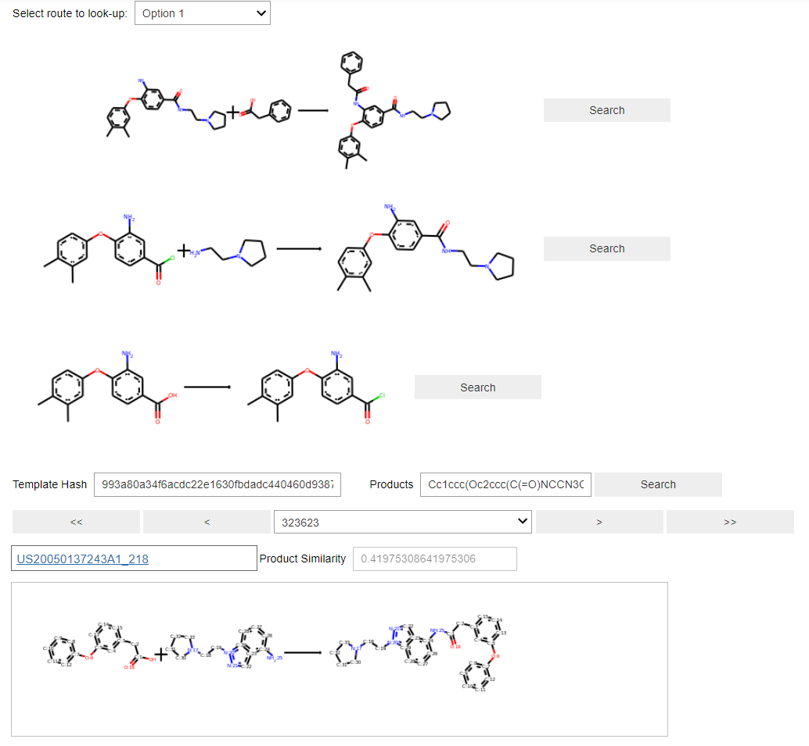

Look-up of reactions
====================

An extension to the Jupyter notebook GUI is provided to enable look-up of reaction data in Reaxys or Pistachio. 

When the routes of a target compound has been found and displayed, create a new cell in the notebook and enter 

.. code-block::

    from aizynthfinder.az.templateinfowidget import RouteReactionLookup
    RouteReactionLookup(app.finder, "full_uspto_03_05_19_rdchiral_template_library.csv")

where the second argument to the ``RouteReactionLookup`` class is a template library. 

When this cell is executed as new GUI is shown. 

1. Select the route you are interested in
2. Press the "Search"-button next to the reaction you are interested in

The GUI will then populate the `Template Hash` (if available) and `Product` textboxes and perform the search in the template library.

The GUI will find the reactions in the template library corresponding to the template of the reaction and sort them based on the similarity of the product. 

Press the blue link to be directed to Reaxys or Pistachio for further research.