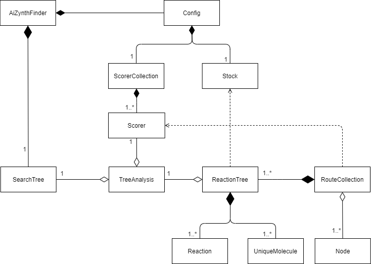

Relationships
=============

This page shows some relationship diagrams, i.e. how the different objects are connect.

These are the tree different types of relationships used:

.. image:: line-desc.png

Tree search
-----------

This diagram explains how the different object are connect that are responsible for the tree search.

.. image:: treesearch-rel.png

Analysis / post-processing
--------------------------

This diagram explains how the different objects involved in the analysis are connected.

